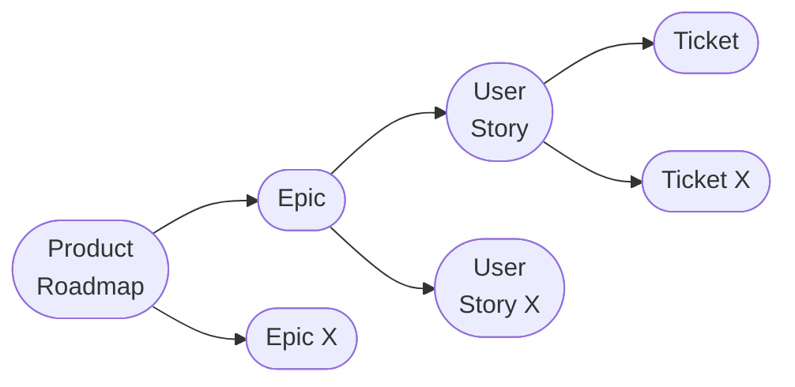

Diagrams as Code (DaC)

[[Artificially Intelligent Agent|Agents]] can be used to generate code-like diagrams or [[Code]] based on them

- They can be versioned
- We can automate documenting of programs
- The team can better collaborate

---

For startups or new products, the stages of defining the [[System]] is very different, the focus is on iterate fast to validate [[Hypothesis]]

Below, how we can do effective planning

---

1 - Defining and [[system-design-interview/concepts/Design|Designing]] the [[System]]

We can use the [[Artificially Intelligent Agent|Agents]] to understand the [[Domain Model|Domain]]

Good to give it a specific role, and details which kind of outcome we expect

An important part of such investigation is search for solutions that were already created:

- For inpiration
- To not reinvent the wheel

This first phase focuses on learning what our domain is about

Good place to think about general [[Cross-Functional Requirement|Cross-Functional Requirements]]

---

2 - Defining [[Use Case|Use Cases]]

We rise the level of [[carreer/development/system-design/concepts/Abstraction|Abstraction]], identifying the different user roles, their [[Use Case|Use Cases]], dependency between things

It might be necessary to intervine manually to correct the route

---

3 - Defining and [[system-design-interview/concepts/Design|Designing]] the [[Data]] [[Domain Model|Model]]

Understand the [[Entity|Entities]] that will be relevant to the [[System]], how they relate to each other and which information we need to hold

[[Artificially Intelligent Agent|Agents]] caan be used to define and [[system-design-interview/concepts/Design|Designing]] the [[Data]] [[Domain Model|Model]]

---

4 - [[System]] [[carreer/development/design/Design|Design]] and high-level [[Software Architecture|Architecture]]

The [[Artificially Intelligent Agent|Agent]]can help us to [[carreer/development/design/Design|Design]] defined the general [[System]]'s structure including its [[Software Architecture|Architecture]], component distribution, integration with external systems and communication patterns

---

5 - Documentation

Throughout all phases, it's essential to save the information collected and decisions taken. Mainly

- [[C4 Model]]
- [[Architecture Decision Record|ADR]]
- [[Product Requirement Document|PRD]]

---

[[Product Management]]

- [[Product Roadmap]]: the highest level is the strategic plan, defining the long-term vision and direction of the product
- [[Epic]]
- [[User Story]]
- Work Ticket: concrete actions to complete USs

---

How to create good [[User Story|User Stories]]

1. Focus on the [[User]]
   1. Write them from their perspective
   2. Use [[Persona|Personas]]
2. Keep it simple and concise
   1. "How as [X], I want [Y] so that [Z]"
   2. Avoid technical details
   3. Small enough for one [[Sprint]]
3. Prioritise and Estimate
   1. A US has value for users and the [[business]]
   2. Estimate effort on doing them
4. Encourage collaboration
   1. The development [[Team]] helps writing them
5. Include [[Acceptance Criteria]]
   1. Do not be technical
6. Keep them up to date

---

How [[Artificially Intelligent Agent|Agents]]can help with [[User Story|User Stories]]

1. Identify them from the [[Product Requirement Document|PRD]]
2. Create them
3. Evaluation: they are pretty good at identifying inconsistencies, gaps o requirement conflicts
4. Revision: clarity can be improved
5. Priotization

---

How [[Artificially Intelligent Agent|Agents]] can help with [[Backlog]]

1. Priotization
2. Creating [[User Story|User Stories]]
3. [[Bug]] detection
4. Impact simulation
5. [[Feedback]] integration

---

How [[Artificially Intelligent Agent|Agents]] can help with [[Task|Tickets]]

1. Gather [[System Requirement|Requirement]] from [[Product Requirement Document|PRD]] or [[User Story|User Stories]]
2. Generate clear [[Acceptance Criteria]]
3. Classify and categorize them
4. Settting their [[Prioritizing|Priority]], [[Effort]] and [[Continous Learning]]
5. [[Asset|Resource]] optimisation to balance load the work between people
   1. Equitative balance
   2. Contextual balance
6. Integrated [[Feedback]]
   1. Check previous work
   2. Recommend

---

Concepts to have in mind for [[Software|Softwares]] [[Development]] [[Task|Tickets]]

- [[Artificially Intelligent Agent|Agents]] for development
- Multiple [[Actors and Roles|Roles]] with agents
- Ticket granularity
- [[Acceptance Criteria]]
- Planning and [[Prioritization]][^1]
- Identify items: keeping reference thought iterations

[^1]: [[Product Backlog]]

---

You can ask the [[Artificially Intelligent Agent|Agent]] to execute [[Sudolang]]